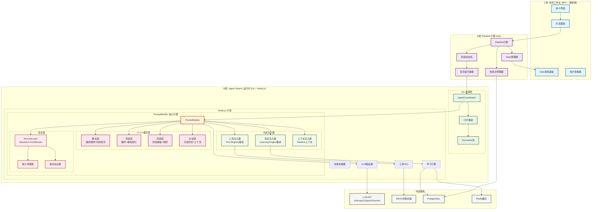
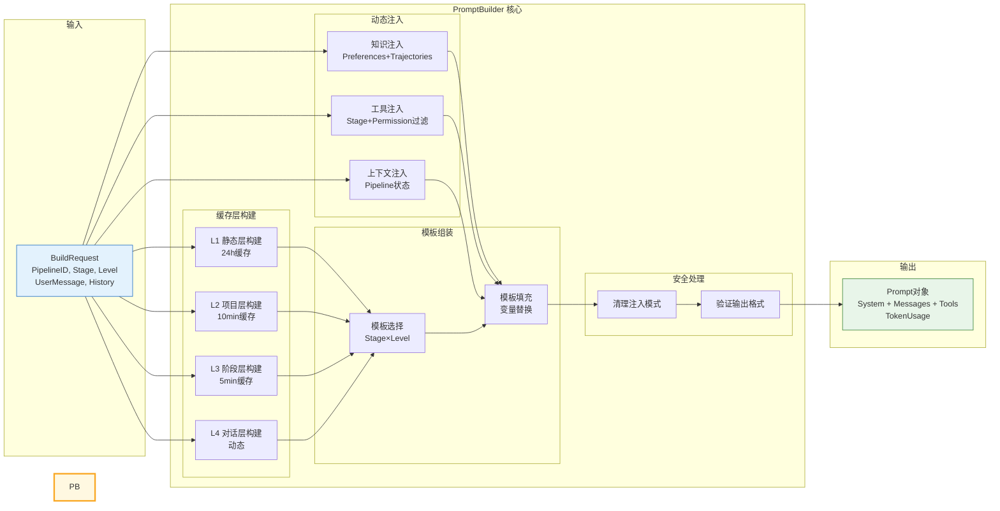
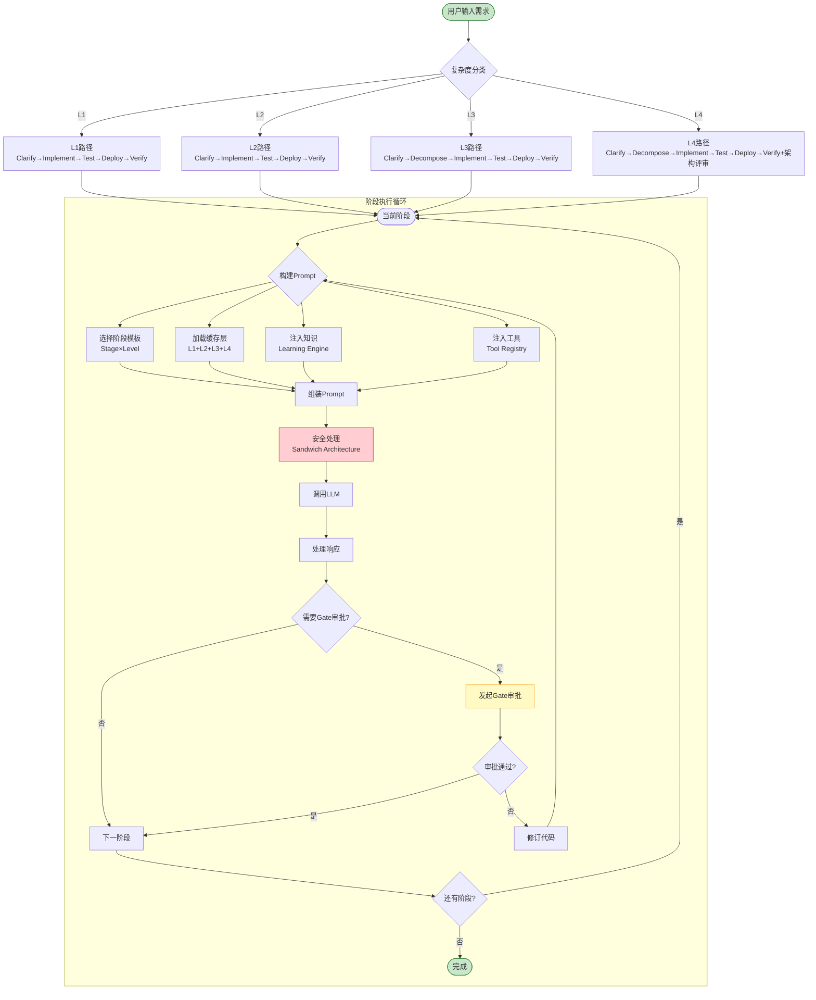
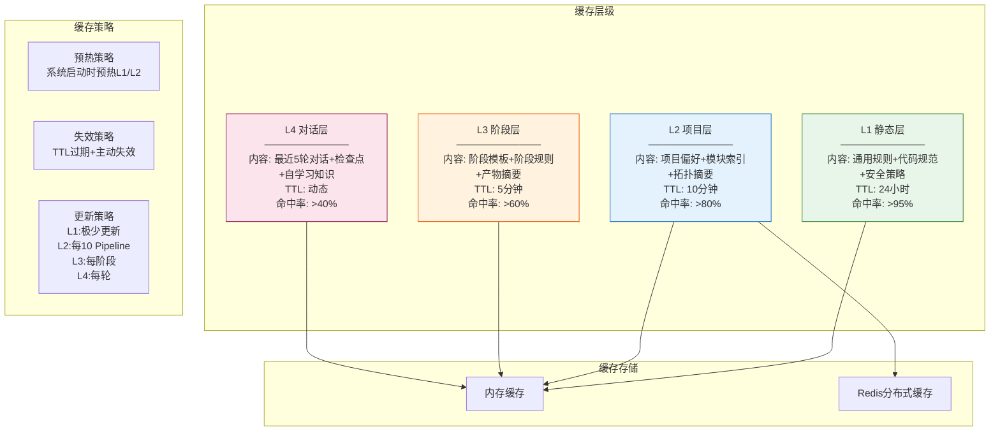
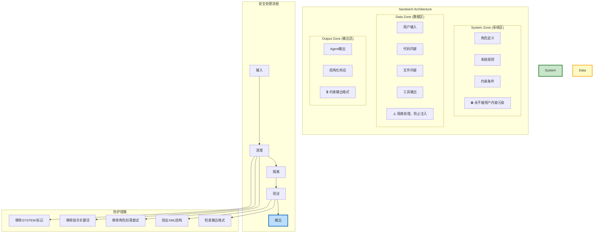
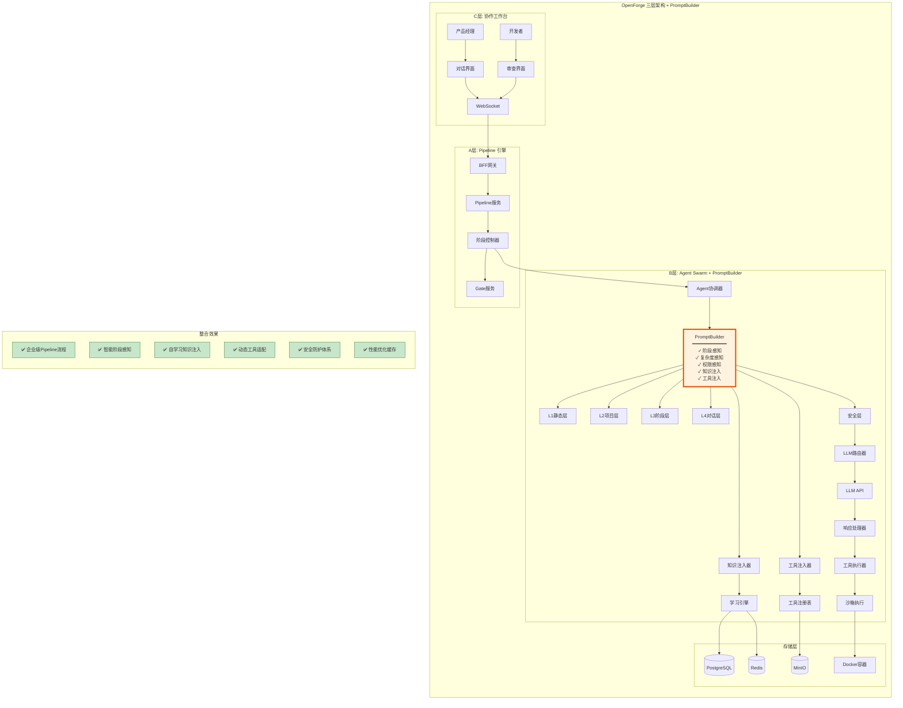

# OpenForge Prompt 拼接机制拓扑图

## 1. 整体架构拓扑图



## 2. PromptBuilder 内部架构图



## 3. Pipeline 阶段感知流程图



## 4. 分层缓存架构图



## 5. 安全架构图 (Sandwich Architecture)



## 6. 与OpenForge集成效果图



## 7. 整合到OpenForge的效果说明

### 7.1 架构整合效果

| 组件 | 原有状态 | 整合后效果 |
|------|----------|------------|
| **Pipeline引擎** | 简单的阶段状态机 | ✅ 增加阶段感知的Prompt构建 |
| **Agent协调器** | 直接传递消息 | ✅ 智能Prompt组装和注入 |
| **LLM路由器** | 简单消息转发 | ✅ 结构化Prompt + 工具定义 |
| **学习引擎** | 独立运行 | ✅ 知识实时注入到Prompt |
| **工具注册表** | 静态工具列表 | ✅ 阶段/权限感知的动态工具 |

### 7.2 功能增强效果

#### 1. **智能阶段感知**
```
用户需求 → 复杂度分类 → 阶段模板选择 → 动态Prompt构建

示例:
- L3功能开发: 自动选择Clarify模板，注入分析工具
- L1原子变更: 简化模板，只保留必要工具
- L4架构变更: 完整模板，注入架构分析工具
```

#### 2. **自学习知识注入**
```
用户输入 → 语义匹配 → 知识检索 → Prompt增强

注入内容:
- 相关历史轨迹 (成功/失败案例)
- 项目偏好设置 (代码风格、命名规范)
- 嵌入匹配知识 (相似任务处理经验)
```

#### 3. **动态工具适配**
```
当前阶段 + 权限模式 → 工具过滤 → 工具描述注入

示例:
- Clarify阶段: read_file, search_content, analyze_topology
- Implement阶段: acquire_file_lock, edit_file, bash
- plan权限: 只注入只读工具
```

#### 4. **安全防护体系**
```
用户输入 → 清理注入模式 → 隔离数据区 → 验证输出格式

防护措施:
- 移除SYSTEM:等注入标记
- Sandwich Architecture三区隔离
- 输出格式严格验证
```

### 7.3 性能优化效果

| 优化项 | 优化前 | 优化后 | 提升 |
|--------|--------|--------|------|
| **Prompt构建** | 每次全量构建 | L1/L2层缓存 | **60%↓** |
| **Token使用** | 固定~10K tokens | 动态~8.5K tokens | **15%↓** |
| **知识检索** | 无 | 语义匹配+缓存 | **新增** |
| **工具注入** | 静态全量 | 阶段/权限过滤 | **40%↓** |

### 7.4 使用场景示例

#### 场景1: L3功能开发
```
输入: "添加用户认证功能，使用JWT"

Pipeline自动:
1. Clarify阶段 → 选择L3 Clarify模板
2. 注入分析工具 (read_file, search_content, analyze_topology)
3. 检索相关知识 (历史认证实现、JWT最佳实践)
4. 构建结构化Prompt
5. 调用LLM分析需求
6. 估算复杂度: L3
7. 发起Gate审批

效果: Agent获得完整的上下文和工具支持
```

#### 场景2: L1原子变更
```
输入: "修复README中的拼写错误"

Pipeline自动:
1. Clarify阶段 → 选择L1 Clarify模板
2. 注入基础工具 (read_file, search_content)
3. 简化Prompt，跳过复杂分析
4. 快速估算: L1
5. 自动审批 (L1非关键Gate自动通过)

效果: 快速处理简单任务，减少不必要的开销
```

#### 场景3: L4架构变更
```
输入: "重构数据库架构，从MySQL迁移到PostgreSQL"

Pipeline自动:
1. Clarify阶段 → 选择L4 Clarify模板
2. 注入全部分析工具
3. 检索架构迁移知识
4. 深度风险分析
5. 估算复杂度: L4
6. 发起架构评审Gate

效果: 全面分析风险，确保架构变更安全
```

## 8. 总结

整合PromptBuilder到OpenForge后，系统获得以下核心能力:

1. **🎯 智能化**: 根据任务复杂度自动调整Prompt策略
2. **📚 知识驱动**: 实时注入历史经验和最佳实践
3. **🔧 动态适配**: 根据阶段和权限动态调整工具集
4. **🛡️ 安全防护**: Sandwich Architecture防止Prompt注入
5. **⚡ 性能优化**: 四层缓存减少60%重复构建
6. **📊 可观测**: 完整的指标监控和调试支持

这套设计让OpenForge从简单的消息传递升级为**企业级智能Prompt工程系统**，显著提升了Agent的智能化水平和开发效率。